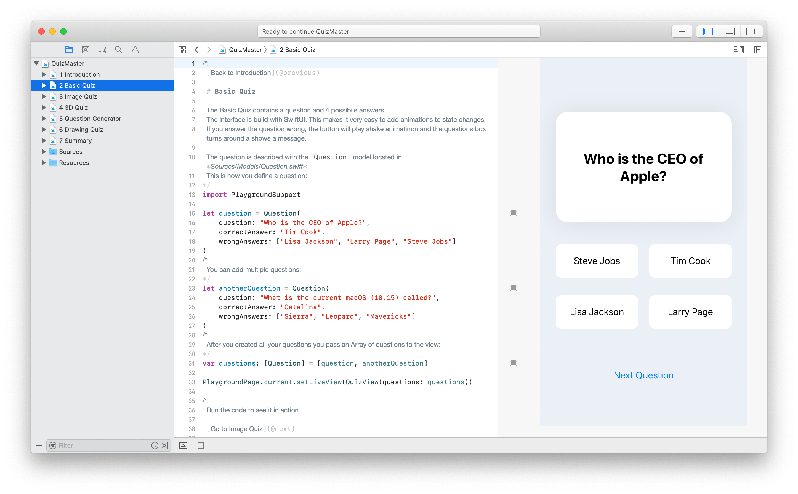

# Quiz Master

## What is this?

This is a demo of a Quiz game. You get asked a question and you can choose from four possible answers.
Apple offers a lot of frameworks and functionalities to enhance the quiz functionalities and user experience. This demo shows some examples how to improve a quiz game with ARKit, NaturalLanguage, PencilKit or CoreML.

## Why?

The motivation behind this idea is to offer teachers and students a platform where they can easily and playful learn more about certain topics.
Due to the Corona virus teachers have to find new ways to motivate their students. This quiz app uses gamification and modern technologies to keep the students focused.